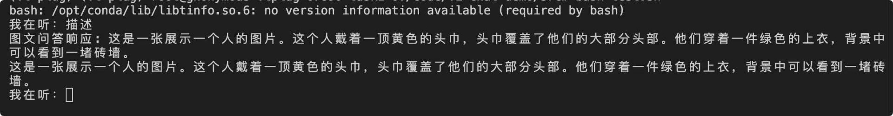

# Simple-MLLM
> Simple-MLLM is a simple locally deployed Multimodal Large Model (MLLM) practice. Let's get your hands on the magic of MLLM, just on your local machine!

😎这是一个在本地部署的**简易**多模态大模型（MLLM）的实例，支持包括图片、文字以及语音（*正在更新*）多种模态的输入。

🤩如果你对多模态大模型（MLLM）感兴趣但是不知如何上手，来看看这个项目：一个简易的项目让你感受到多模态大模型的魔力👍

---
😎This is a **simple** example of deploying Multimodal Large Model (MLLM) locally with support for multiple modal inputs including image, text and voice (*being updated*).

🤩If you are interested in Multimodal Large Models (MLLM) but don't know how to get started. Take a look at this project: a simple project that will give you a taste of the magic of MLLM 👍

## Overview
The input is img as below:

And then I ask the model:"描述”, after that the checkpoints are loaded. Finally:

The output is description as below:

## Based Structure：

* Socket
* Qwen2-VL-3B
* Whisper（*being updated*）